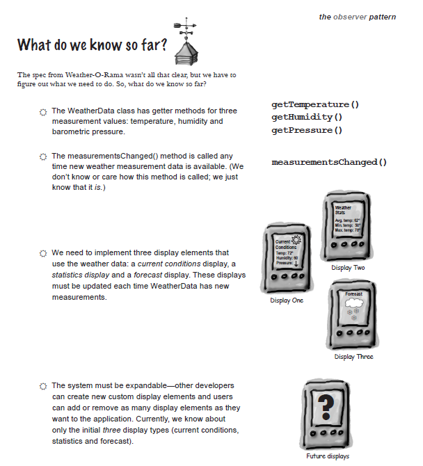

## 2. 옵저버 패턴

[요구사항]

Weather-I-Rama사의 차세대 인터넷 기반 기상 정보 스테이션 구축 프로젝트

기상 모니터링 애플리케이션 개요 
이 시스템은 실제 기상 정보를 수집하는 장비로 습도 센서, 온도 센서, 압력 센서의 값을 수집하고, 기상 스테이션으로 부터 오는 결과(기상 정보 수집 결과)로부터 오는 데이터를 사용자에게 현재 기상 정보를 보여준다. 또한, WeatherData 객체를 사용하여 현재 조건, 기상 통계, 기상 예측 항목을 갱신해 가면서 보여주어야 한다.

최신 측정치 수집 시 실시간으로 갱신 가능해야 하고, 확장 가능해야 한다.

[요구사항 분석]

1. `WeatherData` 클래스에는 세 가지 측정값(온도, 습도, 기압)을 알아내기 위한 게터 메서드가 존재
2. 새로운 기상 측정 데이터가 나올 떄마다 `measurementsChanged` 메서드가 호출된다.
3. 기상 데이터를 사용하는 세 개의 디스플레이 항목을 구현해야 한다. 
3-1. 하나, 현재 조건을 표시 
3-2. 둘, 기상 통계를 표시 
3-3. 셋, WeatherData에서 새로운 측정값이 들어올 때마다 디스플레이 갱신
4. 시스템이 확장 가능해야 한다. 다른 개발자들이 별도의 디스플레이 항목을 만들 수 있어야 하고, 사용자들이 애플리케이션에 마음대로 디스플레이 항목을 추가/제거 할 수 있어야 한다. 
기본 값은 세 가지 기본 디스플레이 형식을 제공한다.

---

일단 옵저버 패턴을 공부하고나서 기상 모니터링 애플리케이션에 어떻게 적용할 수 있는지 알아보도록 한다.

ex.  
Q.신문이나 잡지는 어떻게 구독하는가? 
A-1. 신문사가 사업을 시작하고 신문을 찍어낸다. 
A-2. 독자가 특정 신문사/잡지사에 구독 신청을 하면 매번 새로운 신문/잡지가 나올 때마다 배달을 받는다. 계속 구독자로 남아있다면 계속해서 신문/잡지를 받는다. 
A-3. 신문을 더 이상 보고 싶지 않으면 구독 해지 신청을 하게 되고 그러면 더 이상 신문이 오지 않는다. 
A-4. 신문사가 계속 영업을 하는 이상 여러 개인 독자, 호텔, 항공사 및 기타 회사 등에서 꾸준히 구독 및 해지를 하게 된다.

**출판사(subject) + 구독자(observer) = 옵저버 패턴**

- 출판사 객체에서 일부 데이터를 관리한다. 
- 출판사 객체의 데이터가 달라지면 구독자한테 그 소식이 전해진다. 
- 데이터가 바뀌면 새로운 데이터값이 어떤 방법으로든 구독자들에게 전달된다. 
- 구독자 객체들은 출판사 객체를 구독(출판사 객체에 등록되어 있음을 의미)하고 있으며 출판사의 데이터가 바뀌면 갱신 내용을 전달받는다. 
- 만약 구독자가 아닌 경우라면 출판사 객체의 데이터가 바뀌어도 아무런 연락을 받지 못한다.

