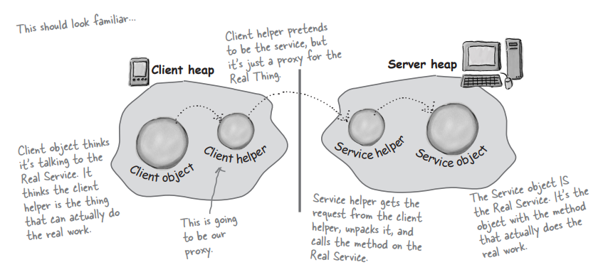
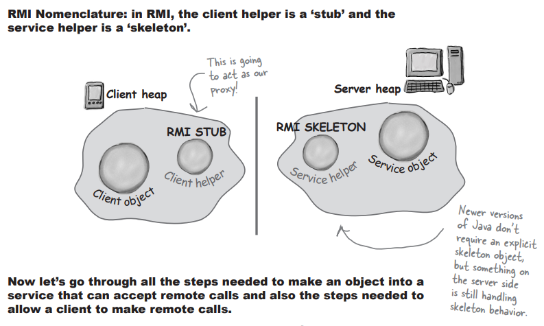

## 11. 프록시 패턴
프록시는 자신이 대변하는 객체와 그 객체에 접근하고자 하는 클라이언트 사이에서 여러 가지 방식으로 작업을 처리하게 된다.

### 원격 프록시의 역할
원격 프록시는 원격 객체에 대한 로컬 대변자 역할을 한다.
> Q. 그렇다면 원격 객체(remote object)란 무엇인가?  
> A. 다른 JVM의 힙에서 살고있는 객체를 뜻한다. 
> Q. 로컬 대변자(local representative)란 무엇인가? 
> A. 로컬 대변자의 어떤 메서드를 호출하면 다른 원격 객체한테 그 메서드 호출을 전달하는 역할을 맡고 있는 객체

### 원격 메서드의 기초
로컬 객체에서 메서드를 호출하면, 그 요청을 원격 객체에 전달할 수 있게 해주는 시스템을 디자인한다고 가정했을 때, 우리 대신 통신을 처리해 주는 보조 객체가 필요할 것이다.  
그리고 이 보조 객체를 이용하면 클라이언트 입장에서는 로컬 객체에 대해서만 메서드를 호출하면 된다. 즉, 클라이언트 보조 객체(client heloper)의 메서드를 호출하는 것이다.

클라이언트 입장에서는 그 보조 객체가 실제 서비스를 제공한다고 생각하게 하면 클라이언트 보조 객체가 그 요청을 원격 객체한테 전달하여 보조 객체가 서비스 객체인 양 행동하게 한다. 하지만, 클라이언트 보조 객체는 진짜 원격 서비스가 아니라는 걸 명심해야 한다.

지금까지의 과정이 원격 메서드의 동작 방식이다.

이제 RMI를 활용하여 원격 메서드를 호출하는 방법을 알아보자.

RMI에서는 우리 대신 클라이언트와 서비스 보조 객체를 만들고, 보조 객체에는 원격 서비스와 똑같은 메서드가 들어있다. 그렇기에 RMI를 이용하면 우리가 직접 네트워킹 및 입출력 관련 코드를 직접 작성하지 않아도 된다.

클라이언트에서는 그냥 그 클라이언트랑 같은 로컬 JVM에 있는 메서드를 호출하듯이 원격 메서드를 호출할 수 있다.

> RMI 용어
> RMI에서 클라이언트 보조 객체는 스터브(stub), 서비스 보조 객체는 스켈레톤(skeleton)이라고 부른다.

